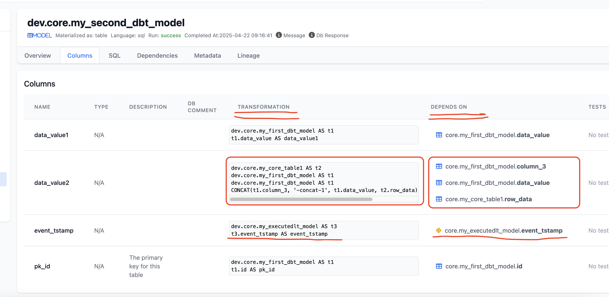

# Opendbt Catalog

[See it in action](https://memiiso.github.io/opendbt/opendbtdocs/)

## Generating the Enhanced Catalog

To generate the enhanced catalog UI with column-level lineage, use the opendbt CLI:

```bash
python -m opendbt docs generate
```

This command will:
- Generate standard dbt catalog files (`catalog.json`, `manifest.json`)
- Generate `catalogl.json` with column-level lineage information
- Deploy the enhanced catalog UI to your target directory

**Important:** Using the standard `dbt docs generate` command will generate only the basic dbt documentation without the enhanced UI and `catalogl.json` file.

### Catalog Files Summary

- [catalog.json](catalog.json): Generated by dbt
- [catalogl.json](catalogl.json): Generated by opendbt contains extended catalog information with column level lineage
- [manifest.json](manifest.json): Generated by dbt
- [run_info.json](run_info.json): Generated by opendbt, contains latest run information per object/model

## Key Features

### Up to date Run information


### Run information with error messages


### Model dependencies including tests


### Column level dependency lineage, transformation



### Dependency lineage

