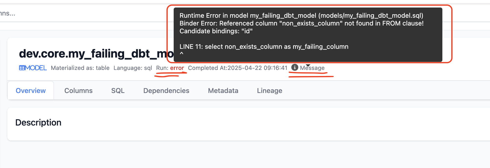
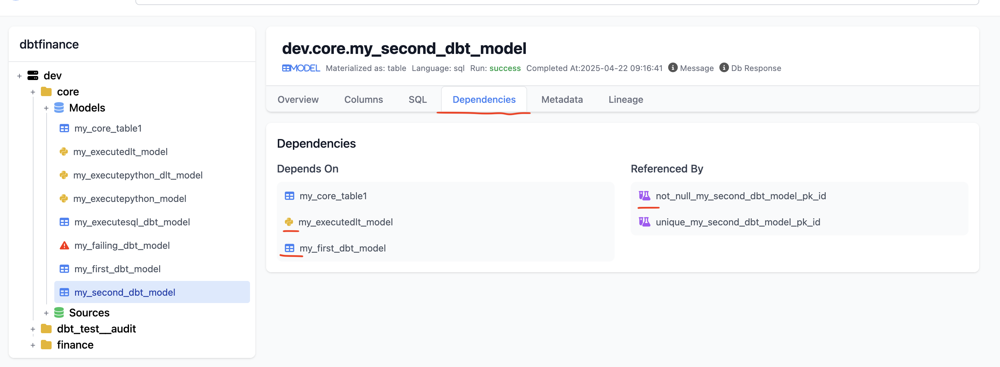

# Opendbt Catalog

[See it in action](https://memiiso.github.io/opendbt/opendbtdocs/)

## Generating the Enhanced Catalog

To generate the enhanced catalog UI with column-level lineage, use the opendbt CLI:

```bash
python -m opendbt docs generate
```

This command will:
- Generate standard dbt catalog files (`catalog.json`, `manifest.json`)
- Generate `catalogl.json` with column-level lineage information
- Deploy the enhanced catalog UI to your target directory

**Important:** Using the standard `dbt docs generate` command will generate only the basic dbt documentation without the enhanced UI and `catalogl.json` file.

## Customizing the Catalog UI

You can override the default enhanced UI with your own custom `index.html` by placing it in your dbt project's `docs` directory:

1. Create a `docs` folder in your dbt project root (if it doesn't exist)
2. Add your custom `index.html` to this folder
3. Ensure `dbt_project.yml` includes the docs path:
   ```yaml
   docs-paths: ["docs"]
   ```
4. Run `python -m opendbt docs generate`

The priority order is:
1. User-provided `index.html` from `docs-paths` (highest priority)
2. Opendbt's enhanced catalog UI (automatic fallback)
3. Standard dbt-generated UI (only if using `dbt docs generate`)

## Multi-project setup

### Core Functionality
   - Added environment variable-based plugin mode switching (single/multi)
   - Plugin now supports both legacy single-project and new multi-project modes
   - Multi-project configuration via Airflow Variables
   - Case-insensitive variable lookup for compatibility with `AIRFLOW_VAR_*` env vars

### Configuration
   - `export AIRFLOW_PLUGIN_MODE=single` (default): Single-project mode with static path
   - `export AIRFLOW_PLUGIN_MODE=multi`: Multi-project mode with Airflow Variable
   - Setup Admin - Variables:
   ```
   dbt_docs_projects: 
      {
         "dbtcore": "/opt/dbtcore/target",
         "dbtfinance": "/opt/dbtfinance/target"
      }
   ```

## Catalog Files Summary

- [catalog.json](catalog.json): Generated by dbt
- [catalogl.json](catalogl.json): Generated by opendbt contains extended catalog information with column level lineage
- [manifest.json](manifest.json): Generated by dbt
- [run_info.json](run_info.json): Generated by opendbt, contains latest run information per object/model

## Key Features

### Up to date Run information


### Run information with error messages



### Model dependencies including tests



### Column level dependency lineage, transformation


### Dependency lineage


### Multi-project support


